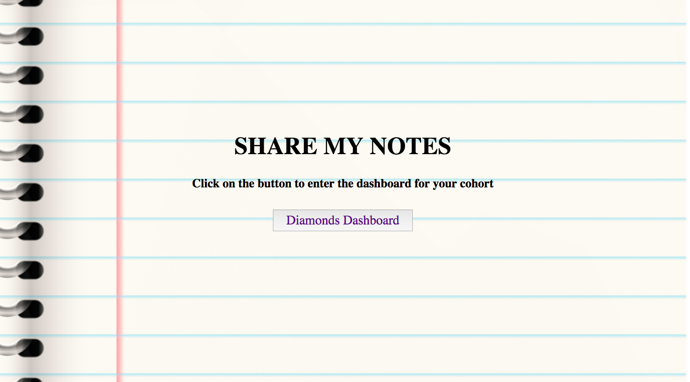

# ShareMyNotes

- Susana Isaza - General Assembly (Dec. 15, 2016)

## **Links**
Hosting: Heroku - https://share-my-notes.herokuapp.com/

## **Summary**
The app is a tool for students to take centralize note-taking and sharing with classmates. It is an easy way for students to have access to multiple notes organized by topics, and also contribute with their own notes.

## **User Stories**
ShareMyNotes allows students to have access to take notes during class and share them with classmates. Students need to access their cohort name in the homepage. When logged in, they will see all class topics displayed on the left side. 

Notes are organized by topic and easily accessible. Clicking on each topic will display a list of all notes associated to that specific topic. Students can browse through all notes (by their titles) and select one to display. The note selected will appear under the "Display Existing Note" heading. 

To create a new note, students can start typing directly under the "Create New Note" header. They can add a Title for the note, select which topic the note will be saved under, and write the note. The note content can be styled with the buttons available above it.

## **Technologies**
- React.js, Draft.js
- Node and express server
- PSQL database
- Hosting: Heroku

## **Approach**
1. Set up React and Webpack
2. Set up MVC structure and Express server
3. Designed ERD, db schema, seed data
4. Organized routes, models
5. Connected server to db
6. Designed and created Component structure
7. Installed Draft.js, set up Draft Editor
8. Styled and deployed

## **Wireframe**

## **Constraints**
- Understanding the structure and functionality of Draft.js 
- Saving and retrieving data for the text editor
- Setting up react router

## **Next Steps**
- User login (teacher and student)
- Adding Draft.js plugins for more editing options
- Delete/Edit notes

## **Attributions**
- Draft.js Rich Text Editor setup: "draftjs-tutorial" (jbasdf) - https://github.com/atomicjolt/draftjs-tutorial
- Draft.js data formatting (for db saving): http://stackoverflow.com/questions/36499858/draft-js-persist-editorcontent-to-database
- Render Draft.js from db (convertFromRaw()): https://www.npmjs.com/package/draft-js-editor
- Models and routes structure - CityGrow (Project 3): https://github.com/svall/citygrow
- Heroku deployment: Phil Winchester - https://github.com/Blockchain-voting/block-ed/blob/master/HelpfulTips.md

## **Resources**
- https://medium.com/@rajaraodv/how-draft-js-represents-rich-text-data-eeabb5f25cf2#.4q9tz0fxk
- https://www.youtube.com/watch?v=feUYwoLhE_4

